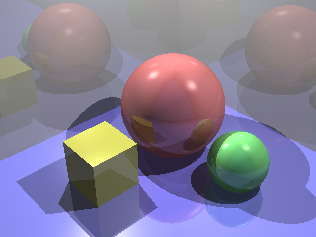

This is a lab assignment of CS3241.

In this lab, I applied Ray-tracing technics to render 3D graphics.

For the first task, I modified Sphere.cpp to render it into the scene.

For the second task, I modified Raytrace.cpp to add lights, reflections and shadows on to the objects in the scene.

For the third task, I modified Main.cpp and added two wavefront models I created using Blender to render a new scene.

