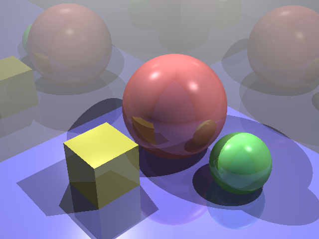
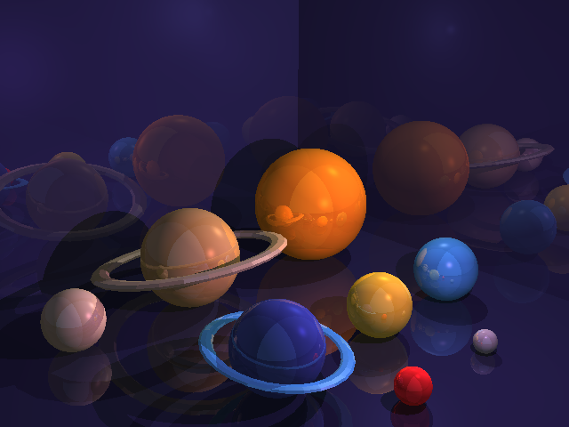

This is a lab assignment for CS3241.

In this lab, I applied the Ray Tracing technic to render 3D graphs.

For the first task, I modified Sphere.cpp to render it into the scene.

For the second task, I modified Raytrace.cpp to add lights, reflections and shadows to the objects in the scene.

For the third task, I modified Main.cpp and added two wavefront models I created using Blender to render a new scene.

